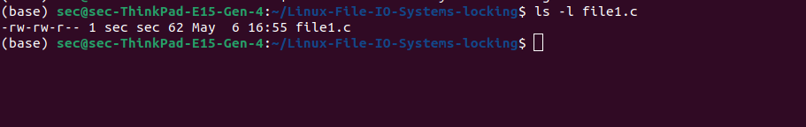
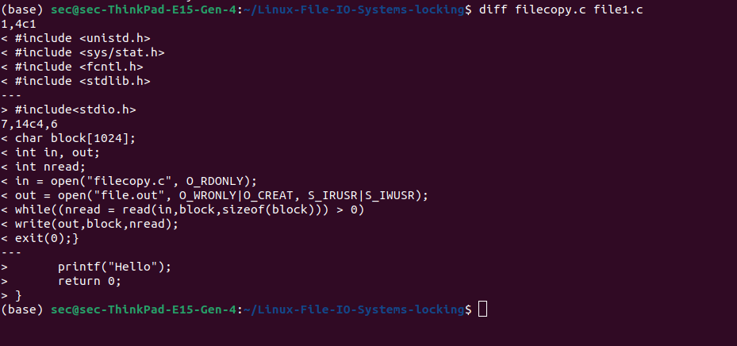
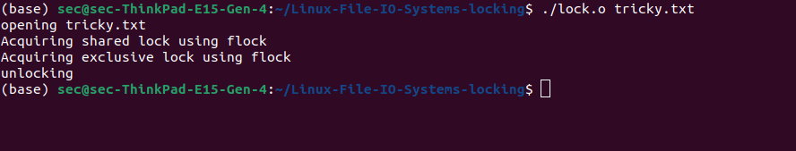
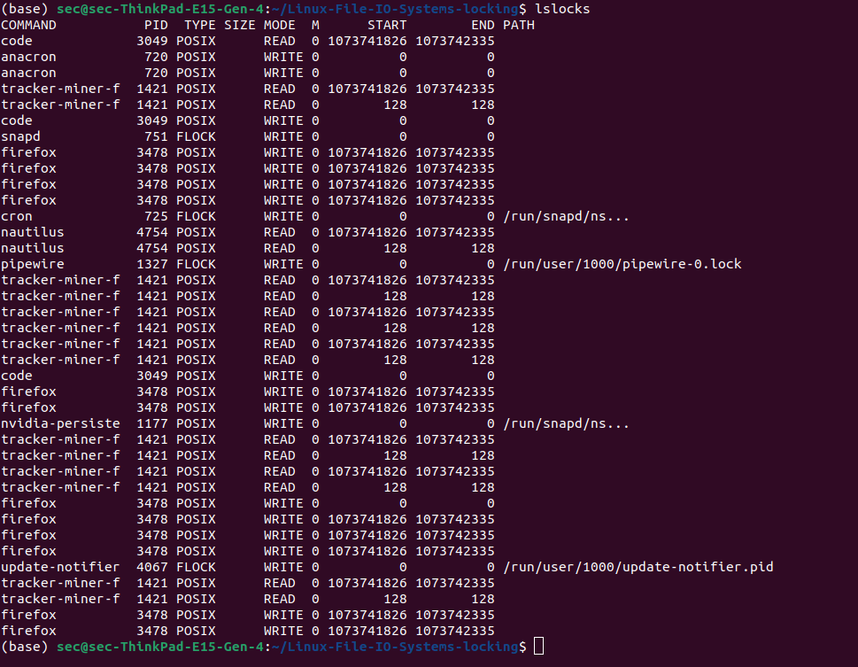

# EX 07: Linux-File-IO-Systems-locking

## DATE: 

## AIM:
To Write a C program that illustrates files copying and locking

## DESIGN STEPS:

### Step 1:

Navigate to any Linux environment installed on the system or installed inside a virtual environment like virtual box/vmware or online linux JSLinux (https://bellard.org/jslinux/vm.html?url=alpine-x86.cfg&mem=192) or docker.

### Step 2:

Write the C Program using Linux IO Systems locking

### Step 3:

Execute the C Program for the desired output. 

## PROGRAM:

## 1.To Write a C program that illustrates files copying 

cat > filecopy.c

```bash
#include <unistd.h>
#include <sys/stat.h>
#include <fcntl.h>
#include <stdlib.h>
int main()
{
char block[1024];
int in, out;
int nread;
in = open("filecopy.c", O_RDONLY);
out = open("file.out", O_WRONLY|O_CREAT, S_IRUSR|S_IWUSR);
while((nread = read(in,block,sizeof(block))) > 0)
write(out,block,nread);
exit(0);}
```
gcc -o filecopy.o filecopy.c

ls -l file1.c


## OUTPUT



diff filecopy.c file1.c

## OUTPUT



## 2.To Write a C program that illustrates files locking

```bash
//C program that illustrates files locking goes here
#include <fcntl.h>
#include <stdio.h>
#include <string.h>
#include <unistd.h>
#include <sys/file.h>
int main (int argc, char* argv[])
{ char* file = argv[1];
 int fd;
 struct flock lock;
 printf ("opening %s\n", file);
 /* Open a file descriptor to the file. */
 fd = open (file, O_WRONLY);
// acquire shared lock
if (flock(fd, LOCK_SH) == -1) {
    printf("error");
}else
{printf("Acquiring shared lock using flock");
}
getchar();
// non-atomically upgrade to exclusive lock
// do it in non-blocking mode, i.e. fail if cannot upgrade immediately
if (flock(fd, LOCK_EX | LOCK_NB) == -1) {
    printf("error");
}else
{printf("Acquiring exclusive lock using flock");}
getchar();
// release lock
// lock is also released automatically when close() is called or process exits
if (flock(fd, LOCK_UN) == -1) {
    printf("error");
}else{
printf("unlocking");
}
getchar();
close (fd);
return 0;
}

```
gcc -o lock.o lock.c

./lock.o tricky.txt 

## OUTPUT



lslocks

## OUTPUT




# RESULT:
The programs are executed successfully.
